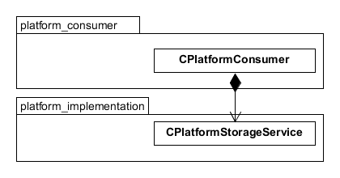
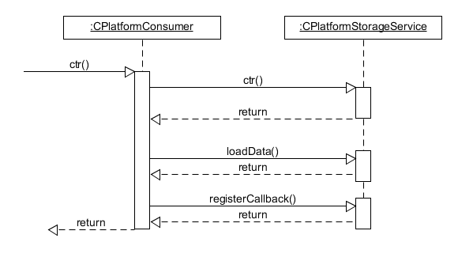
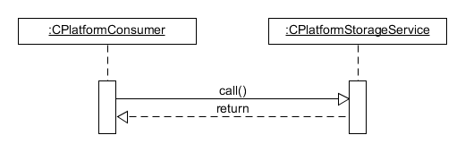
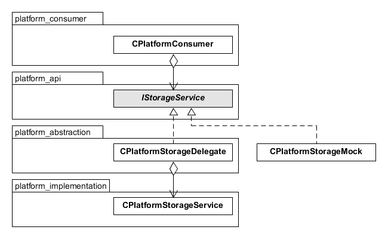
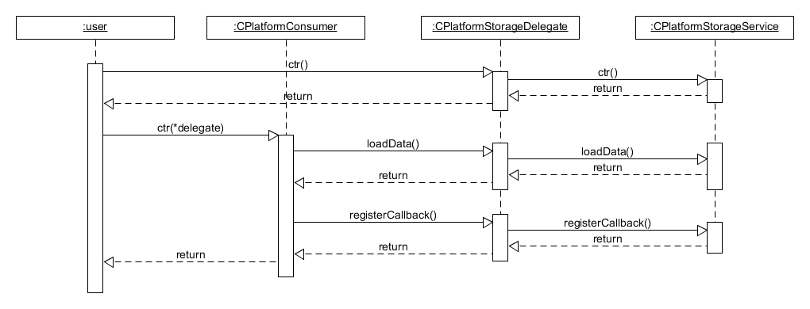
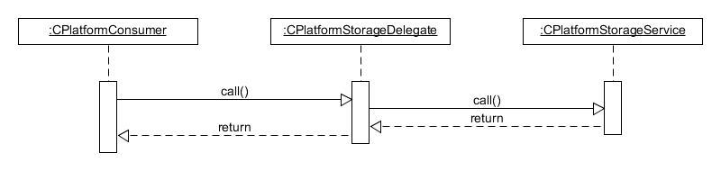
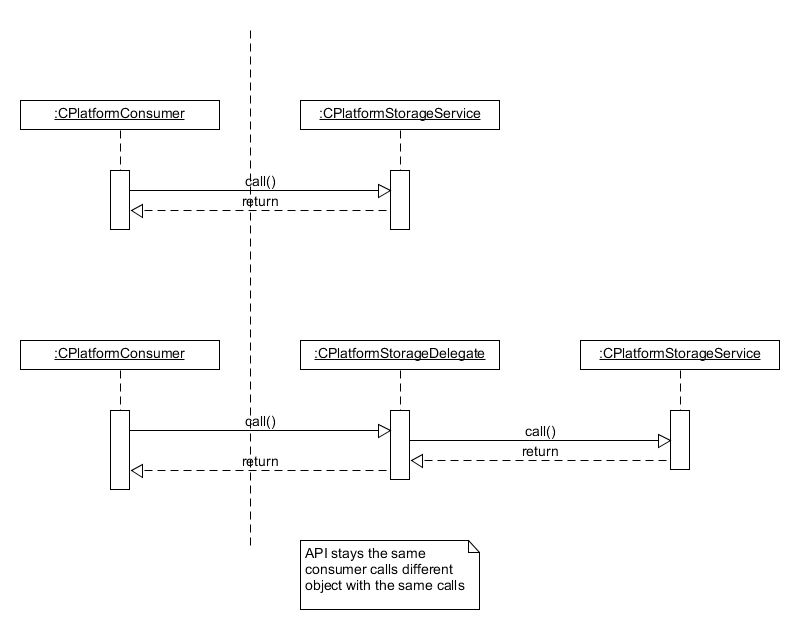

- [1. Dependency Injection Example](#1-dependency-injection-example)
  - [1.1. Given `NO DI`](#11-given-no-di)
    - [1.1.1. Classes](#111-classes)
    - [1.1.2. Construction](#112-construction)
    - [1.1.3. Interaction](#113-interaction)
  - [1.2. Step `Use DI`](#12-step-use-di)
    - [1.2.1. Classes](#121-classes)
    - [1.2.2. Construction](#122-construction)
    - [1.2.3. Interaction](#123-interaction)
    - [1.2.4. Difference](#124-difference)

# 1. Dependency Injection Example

## 1.1. Given `NO DI`

Given class `CPlatformConsumer` which provides a way to do long and complex computation.
To save the stat it uses `CPlatformStorageService` which acts as a persistent memory storage.
Every time consumer created it request last calculated value from the persistent storage and every time on destruction it stores newly calculated value.

### 1.1.1. Classes

Consumer holds an instance of the Service and control its life cycle. Consumer directly calls Service.

### 1.1.2. Construction

Consumer creates Service instance.

### 1.1.3. Interaction

Consumer directly calls service using its API.

## 1.2. Step `Use DI`

To provide better granularity of entire solution and introduce practically good way of unit testing the Consumer [Dependency Injection technique](https://en.wikipedia.org/wiki/Dependency_injection) was used.

### 1.2.1. Classes

Consumer knows only the Service API and doesn't care about Service's life cycle. It holds a reference to the abstract class which describes an API. Implementation provided from outside. Delegate is a class that implements an API and sends all actual call to the real Service, which was instantiated during the Delegate construction. Other implementation of the API is a Mock class which is used during testing.

### 1.2.2. Construction

Delegate creates first and the real service created in this moment. (Only Delegate has a dependency to the Service). Delegate the propagated to the Customer as a constructor argument.

### 1.2.3. Interaction

Consumer calls Delegate which in its turn calls Service.

### 1.2.4. Difference

In both cases Consumer calls an object which wasn't changed while transition from first solution to the second one, where DI was introduced.

So in this perspective nothing has to be changed into the code of Consumer.

What is required to be done to introduce the DI:

1. API extraction to the abstract class.
1. Delegate implementation.
1. Construction of the Consumer has to be changed - all the dependencies come from outside.
